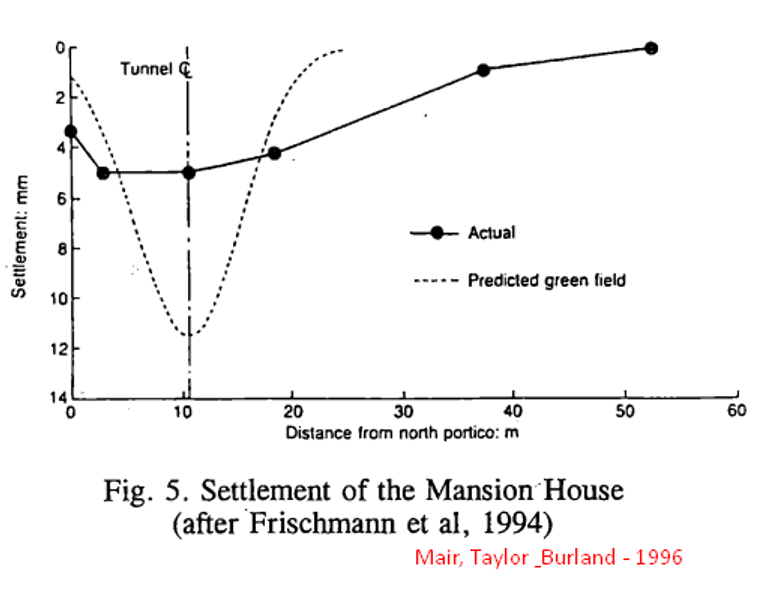
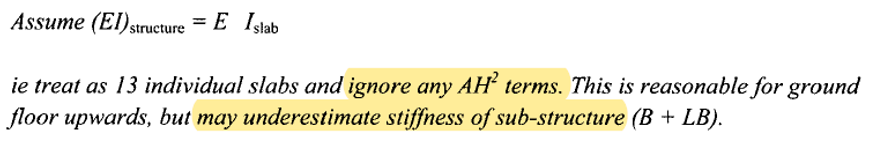
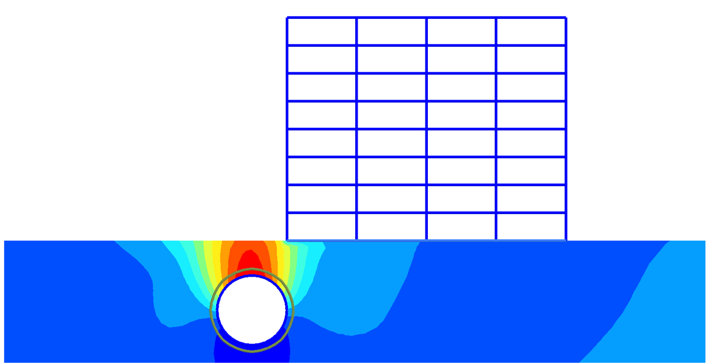
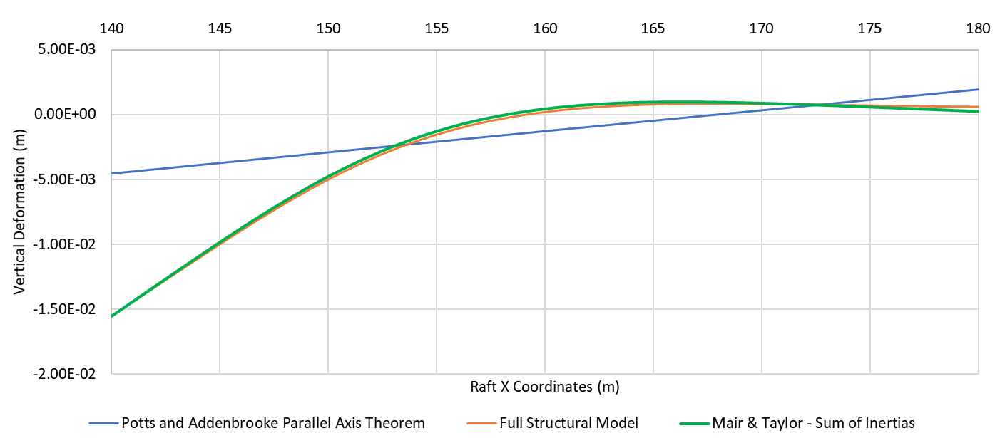

Estimating damage level on the existing buildings due to tunnelling is a tricky business which depend on many factors and cannot be over-simplified. But one of the simplifications that has been used commonly is *equivalent beam method.*

*Equivalent beam method* allows us to simplify the rigidity of buildings in a simple Mindlin beam. Why do we need the rigidity of the building to come into our numerical models? We have many evidences that show us *greenfield deformations* (which are deformations due to tunnelling on level ground without any structure.) are much higher and narrower than building deformations caused by tunnelling. One evidence is given my Frischman et. al. (1994) and reported by Mair, Taylor and Burland (1996).

So, we need the rigidity of the structure to be modelled and we need it as close as possible to the reality. How? We can model the structure every time we model a tunnel problem, this is an option of course, but an option for people with lot of time. We need a simpler solution.

The simpler solution is equivalent beam method. To determine the EI and EA of the beam, we have to come up with a methodology that allows us to simplify the building. Potts and Addenbrooke (1997) have proposed calculating moment of inertia of the building with respect to neutral axis, considering only slabs using parallel axis theorem. (If you forget: Moment of inertia of a beam at point P at a distance y to its neutral axis is I_P=I+A*y².

As authors state, this is an over-estimation since this assumption holds true only for rigidly framed structures. But they also summarize another method which is also described in CIRIA report 200 by Mair and Taylor (2001). Using this method, authors have predicted the deformations before the construction (Class A prediction) and results are very close to measurements. In this method, moment of inertia of each slab is summed up by neglecting A*y² term.

Note that in both methods equivalent area of the beam can be calculated using sum of the area of each slab.

Goh and Mair (2014) developed a third approach which adds column stiffening factor, C of Meyerhof to approach given in Mair and Taylor (2001). However, calculation of C requires detailed information on column and beam positions which may not be readily available in every project. But, to make a note, I should state that, if you will perform a detailed analysis for a significant building, you should definitely use this paper (if you will not model the building in full detail.)s

Goh and Mair (2014) states that parallel axis method is over-estimation of the building rigidity while algebraic sum of moment of inertias is under-estimation. To be honest, parallel axis method was looking better for me. However, a **very very simple experiment** proved me wrong.

I have modelled a building in almost-full detail. Of course, there are still many simplifications such as connections of slabs and columns, but it is a simple trial, so this should do. I have created three models using Plaxis 2D 2019:

- Full structural model with beams and columns modelled explicitly.
- Equivalent beam model using parallel axis theorem.
- Equivalent beam model with algebraic sum of moment of inertias of slabs and raft.

Views of full structural model and equivalent beam model are given below:

Results are very surprising for me:

What do we see here? First of all, due to very high EI and EA calculated using parallel axis theorem resulted in a rigid beam rotation without significant bending of the beam. But full structural model does not behave like this. In fact, vertical deformations calculated using full structural model and equivalent beam using algebraic sum of inertias practically **same.** Same conclusion applies to lateral deformations too.

So, this simple work-out tells us that algebraic sum method is much more suitable for framed buildings. What is your opinion and experience on this topic? What is your daily practice when assessing tunnel-induced damages on buildings?

## References:

- Potts, D. M., & Addenbrooke, T. I. (1997, April). A structure's influence on tunnelling-induced ground movements. In *Proceedings of the Institution of Civil Engineers: Geotechnical Engineering* (Vol. 125, No. 2).
- Mair, R. J., & Taylor, R. N. (2001). 14 Elizabeth House: settlement predictions. *Building Response to Tunnelling: Case Studies from Construction of the Jubilee Line Extension, London*, *1*, 195.
- Goh, K. H., & Mair, R. J. (2014). Response of framed buildings to excavation-induced movements. *Soils and Foundations*, *54*(3), 250-268.