2 years ago in Plaxis User Meeting in İstanbul, I have presented a detailed discussion on Hardening Soil Model. The presentation was really welcomed by the audience and in fact, later on, I have been invited to two other companies for the same presentation. This short post will be a summary of that presentation.

Hardening Soil model (will be called **HS** from now on) was presented in an excellent conference for 10th year of Plaxis in a paper called *The hardening soil model: Formulation and Verification* by Schanz, Vermeer and Bonnier. However, HS is tightly bonded to previous studies on the literature such as Lade, Tatsuoka and Ishihara, Cam-Clay model, Kondner and Zelasko, Jardine, Duncan and Chang, Al Tabbaa, Simson et. al.

# What is Hardening?

Hardening behaviour of soils is shown on the experiments on Tatsuoka and Ishihara (1978) on sand samples. On each cycle, yield starts on the previous cycle's maximum stress. We will see that later on on the preconsolidation pressure concept of HS.

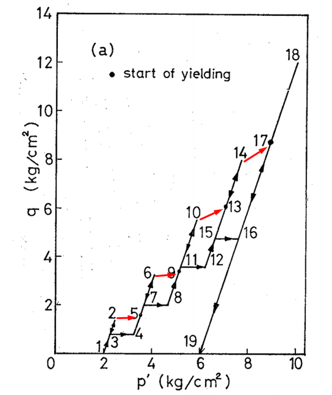

Vermeer (1978) defines a hardening parameter to **expand the yield surface** which is also an integral part of the HS model.

> The yield surface moves in conjunction with some measure for the plastic strains which is called the hardening parameter.

He clearly describes the hardening effect on the soils with the following:

> The concept of a yield locus or yield surface is felt to be the most important concept of plasticity theory. It is a surface in stress space (a curve in the p, q-plane) separating stress states **which can be reached elastically** (the elastic domain) from those which **can only be obtained after plastic deformation or cannot be achieved at all**.

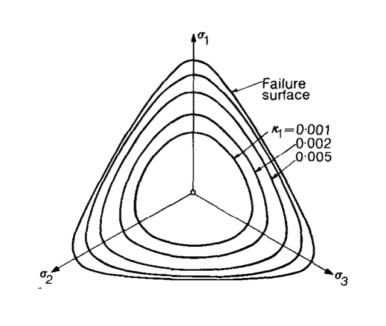

Hardening means that **yield surface is not fixed** as described in Plaxis Material Manual. There are two types of hardening:

* Shear Hardening
* Compression Hardening

Let's take a look at these concepts.

## Shear Hardening

According to Plaxis Material Manual, shear hardening is used to model irreversible strains due to primary deviatoric loading. If we ignore the fancy functions for calculating strain, simply it can be defined as the ratio of failure divided by the $E_{50}$. So, here comes the difference between each stiffness modulus in HS. $E_{50}$ if used for shear deformations. (Also, Eu is used in the formulations.)

*Primary deviatoric loading* is used everywhere in HS literature. However, I went over 875 google results 2 years ago and there are only two definition. One of them is given in first sentence of this chapter and other is *"When subjected to primary deviatoric loading, soil shows a decreasing stiffness"*. This is a concept deriven from Kondner (1963) and Duncan and Chang (1963): Hyperbolic relationship between deviatoric stress and stiffness. *Primary* simply means virgin loading. Deviatoric loading is same as we know from triaxial test.

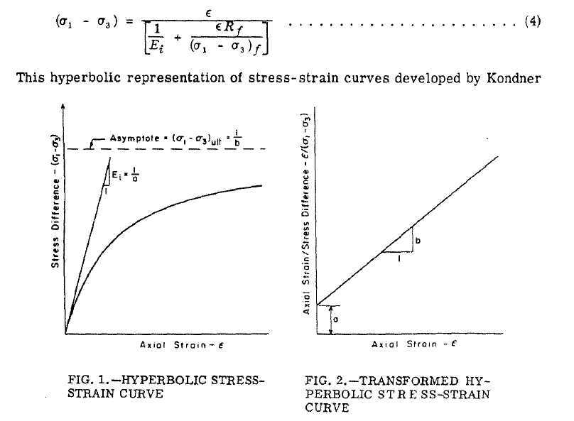

To simplify;

* Shear hardening depends on $E_{50}$.
* Plastic strains occur before the yield. 

## Compression Hardening

Compression hardening is not something unfamiliar to us. It is around here since Terzaghi. Preconsolidation pressure is used in consolidation calculations to seperate the virgin loading and reloading parts. 

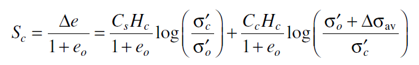

We should know that: Plastic yielding depends on the position of yield surface. So, if we exceed the yield surface, plasticity comes into action. Puzrin (2012) describes it really well:

> The plastic yielding always begins when the current pre-consolidation stress (i.e. the largest mean effective stress before the unloading) is exceeded in reloading.

Contrary to shear hardening, in compression hardening $E_{oed}$ is used for strains.

## Graphical Representation

I have prepared a colorful figure to describe the yield surfaces in HS model. We have different regions:

* Elastic part is shown in green region. In this region, we have elastic behaviour and material stiffness is derived from Eur. 
* If we move on K0 line, we will reach compression yield surface (cap) and in that zone, $E_{oed}$ is used.
* If we have shear we can move to shear hardening zone where $E_{50}$ is used for shear strains.
* Or naturally, we can have combined hardening due to both shear and compression.
* If we get too far from the K0 line, we can reach to Moh-Coulomb failure line.

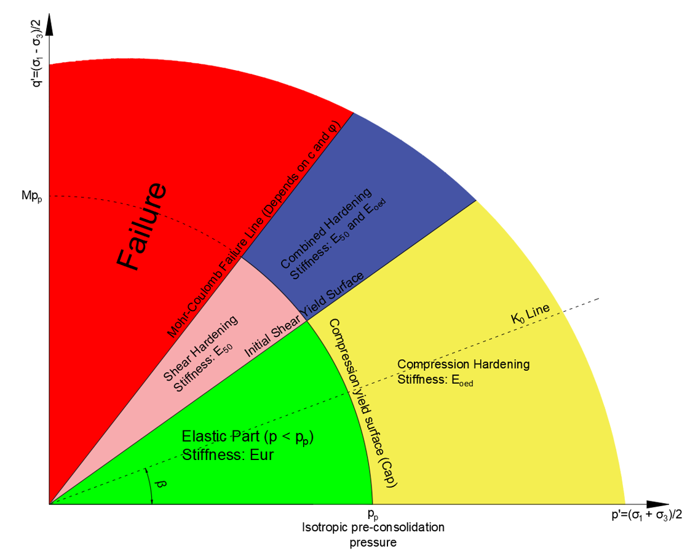

Strain types are shown in the figure below.

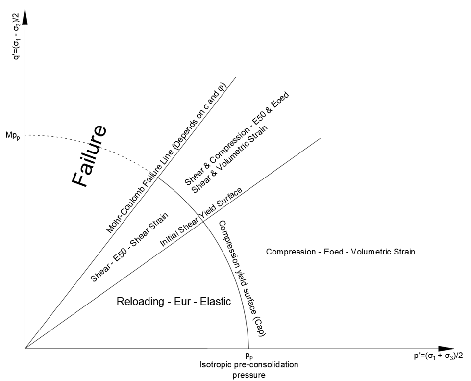

### Journey of a Particle

Let's see what happens when we load a initially elastic particle as shown below with red star.

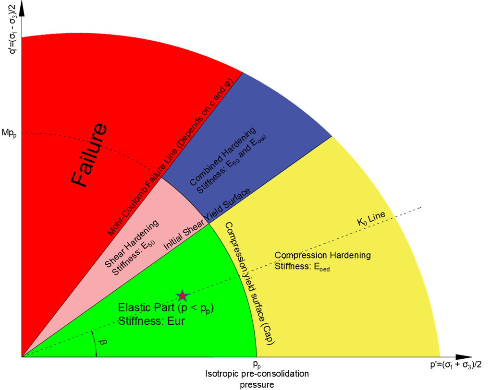

If we load the particle on K0 loading type, it will move on the K0 line. The initial preconsolidation pressure is now recalculated based on the maximum new stress. Based on the new preconsolidation pressure, yield surface expands. With expanding yield surface, elastic part where we use Eur is expanded too. So, if load is reduced now between blue star and red star, soil move on elastic region.

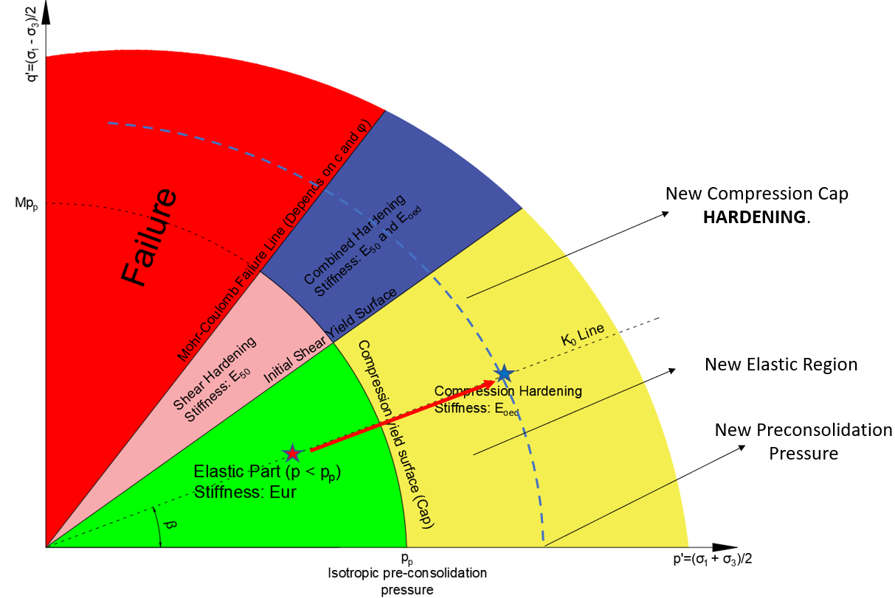

If we load the soil in given direction below, it will cause shear hardening and this time initial shear yield surface will expand.

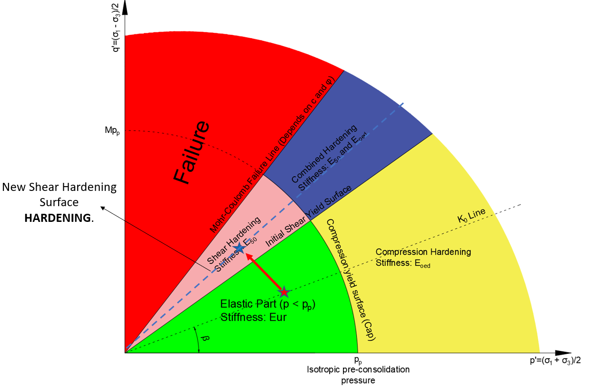

If we load the soil in compression hardening zone with shear loading, it will enter to combined hardening part. In this case, both yield surface will expand.

If we expand these surfaces up to Mohr Coulomb failure line and rotate it around the origin, we can have the classical shape we see in literature.

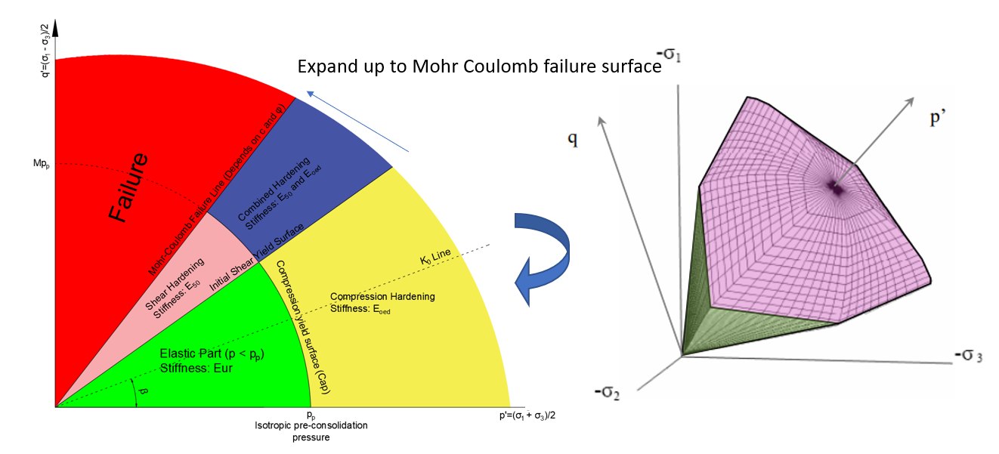

## Other Points Regarding Implementation of HS

Some additional random points:

* Strains affect each other due to nature of equations. 
  * Volumetric strains (compression) affect shear strains.
  * Shear strains affect volumetric strains.
  * Therefore, they pull others to themselves, i.e. combined loading.
* Preconsolidation pressure is not related to vertical loading only as in soil mechanics. Shear loads also affect the preconsolidation pressure.

**Normally Consolidated Soil** is the soil where preconsolidation pressure is equal to soil's current loading. So, that soil is **located on the yield surface.** As Brinkgreve (2005) says:

> Starting from a normally consolidated stress state, any stress path involving 'loading' leads to plastic straining, but this should not be confused with failure.

# Examples

Let's see some examples. Using the Plaxis' option to see plastic points, we can observe these hardening behaviours.

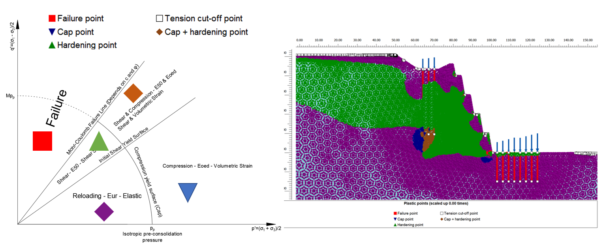

Another example is shown below. We can see that due to load beneath the retaining piles and (maybe) due to little overturning, there is combined and compression hardening below the piles. 

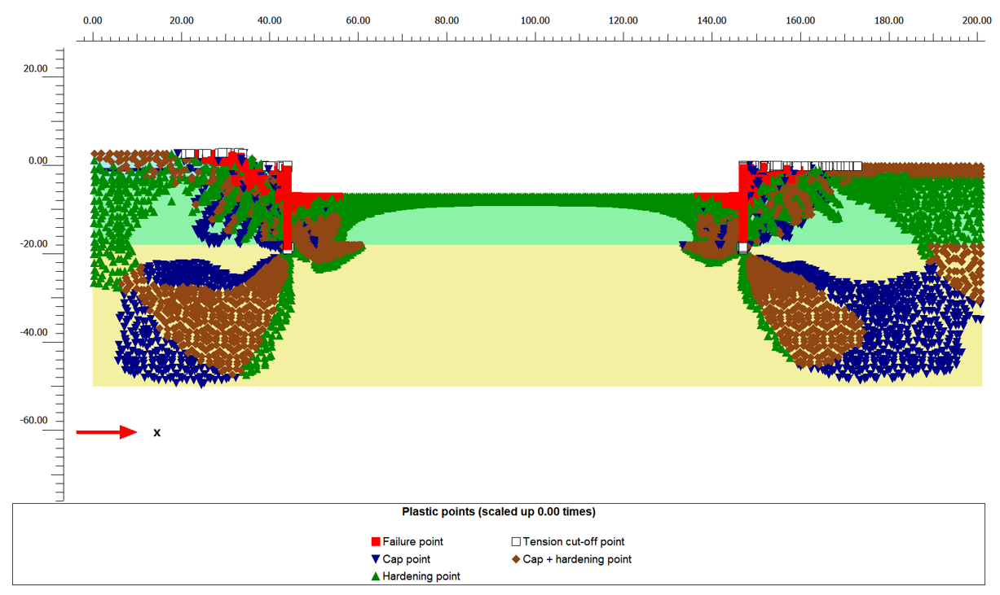

# Parameters

## Stiffness Modulus

Stiffness modulus of soil in HS depends on:

* Reference stiffness modulus
* $\sigma_3$: Lateral pressure on the soil
* $p_{ref}$: Reference pressure
* $m$: Power for stress-level dependency of stiffness
* Strength parameters

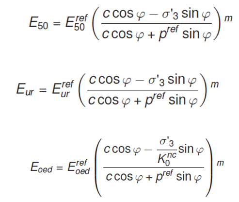

What do we see here? For a reference pressure of 100 kPa (we will talk about later), we see that stiffness modulus is directly proportional to lateral pressure (or pressure on soil, in general). If lateral pressure on soil is **different than** $p_{ref}$, E **will not be equal to** $E^{ref}$.

### E50

**Reference modulus** means that stiffness modulus calculated at all-around pressure equal to pref. Plaxis uses 50% secant modulus. So, our procedure will be:

* Perform triaxial test up to failure load qu at reference pressure (all-around pressure) pref.
* Find the strain at qu/2 and calculate the $E_{50}^{ref}$.

$$E_{50}^{ref}=\frac{0.5q_u}{\varepsilon_{1,50}} $$

An example calculation is given below. Calculated E50 = 30.8 MPa is valid for pref = 100 kPa. So, when we define the material model in Plaxis, the default pref = 100 kPa value is correct for this case.

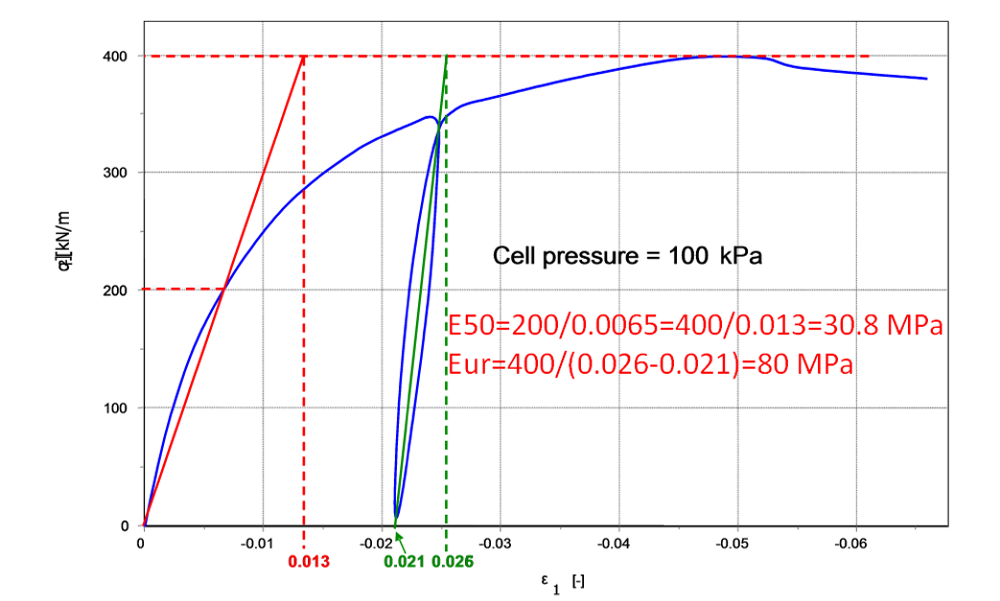

Let's see another case. In this case, since y axis is given in a different configuration, some adjustments are needed. We can see from the calculations that E=200 MPa but it is valid for pref = 795 kPa. So, we have to change the reference pressure to 795 kPa before defining the stiffness modulus.

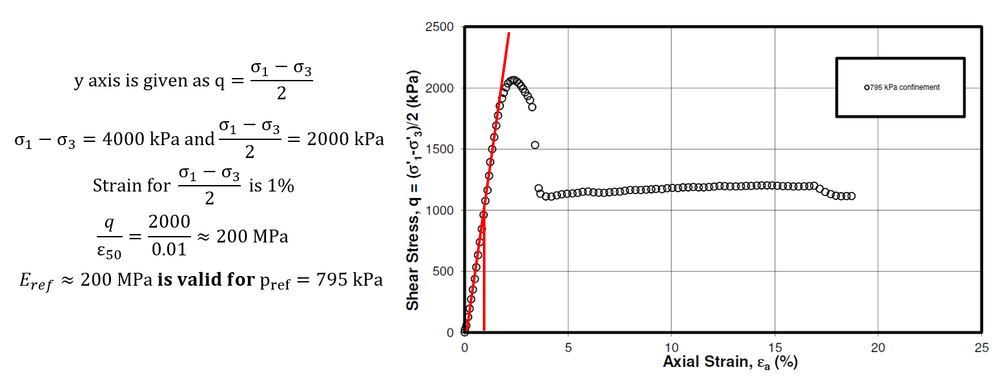

Best way to calculate input values for different stiffness and all-around pressure values, if you have the enough number of data, is to plot the data on $$E_{50}/p_{ref}$$ & $$\sigma_3/p_{ref}$$.  An example calculation is shown below. In this case, if pref = 100 kPa, E is equal to 71 MPa and m = 0.66.

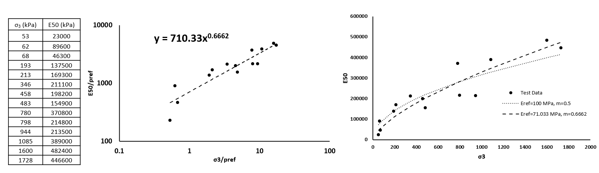

We know that **we don't always have good quality laboratory tests** on hand. So, we usually use correlations with different site investigation methods. It is not very often to see reference pressure for stiffness correlations in literature. In that case, reference pressure of 100 kPa is usually selected since a good percentage of triaxial tests can be assumed to be performed on 100 kPa all-around pressure. However, there is no justification for this assumption.

# Eoed

There is also a simple method to calculate Eoed from oedometer tests although some can find this method unreliable. We can use elastic equations or simply $E_{oed}=1/m_v$. 

How do we select the mv value to be used in the equation? In soil mechanics, we select the mv value based on the pressure we expect since mv depends on the pressure level. What about in Plaxis? For example, if we expect 300 kPa embankment load, should we select the mv from 300 kPa range? No! We have to select it based on the pref value we use. If we use pref = 100 kPa, we have to select the mv at 100 kPa range. 

Using the same approach described before, we can calculate the Eoed as below:

* Take the 1/mv values and pressures from the oedometer tests.
* Select a pref.
* Divide Eoed and pressured to pref.
* Draw the Eoed/pref and pressure/pref on logarithmic axes.
* Draw a trendline in Excel using power function.

An example of this procedure is shown below:

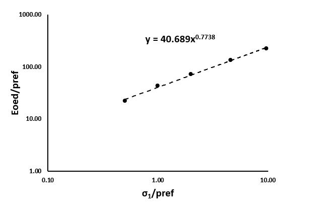

### Eur

Eur is usually correlated to E50. Usual range is 2-6. In my opinion, we can use cr and cc ratio obtained from oedometer test to determine this ratio. Kulhawy & Mayne (1990) correlations on cc and cr shows that cr/cc=5.27. Duncan et. al. (1980) recommends a range between 1.2 and 3.0.

## m, Power for Stress Level

Power for stress level, m, is recommended by Plaxis as 0.5 for sands and 1.0 for clays. There are also correlations given by Hicher (1996) and Viggiani and Atkinson (1995) quoted in Z-Soil's Hardening Soil manual. 

**Hicher (1996) Correlation:**

$$ m=1.13-\frac{49}{LL+78} $$

**Viggiani and Atkinson (1995) Correlation:**

$$m=1-\frac{10.83}{PI+18.7}$$

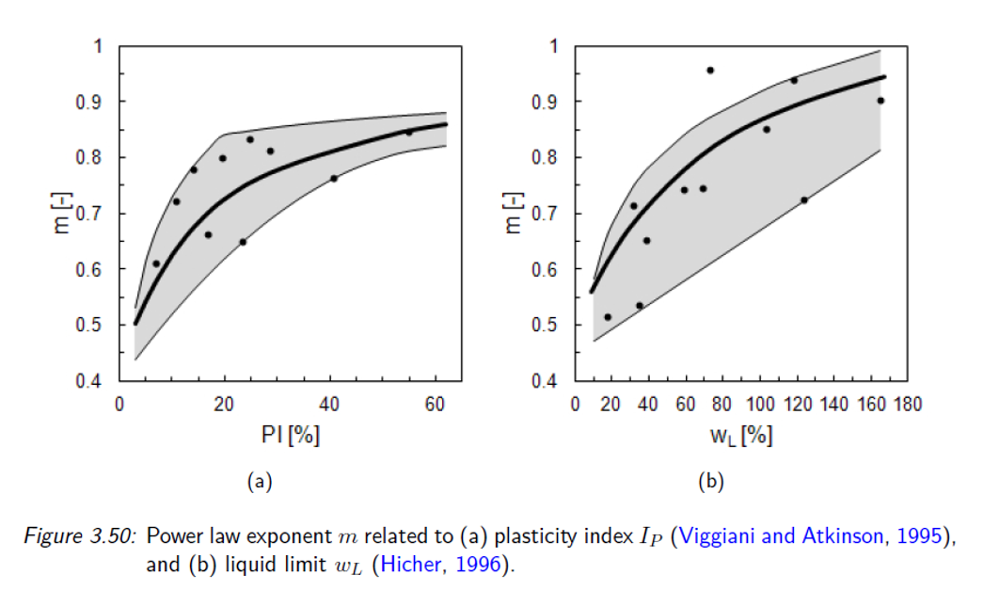

Also, Brinkgreve et. al. (2010) recommends following equation for granular soils. (See the original paper for other correlations regarding the HS parameters.)

$$m=0.7-RD/320$$

## Reloading Poisson's Ratio, v_ur

Unloading/reloading poisson's ratio is denoted as $v_{ur}$. It should be noticed that $v_{ur}$ is **not** classical poisson's ratio! In the absence of laboratory data, it should be left as the default value 0.2.

## OCR / POP

Overconsolidation Ratio (OCR) and Pre-Overburden Pressure (POP) are used to define the initial state of the material. In case of high OCR values, K can be too high since K depends on OCR. This may cause plastic points in initial stage.

## Rf

Failure ratio, Rf, is defined by Duncan & Chang (1970) to come up with a value at failure pressure due to asymptotic behaviour. It is recommended to keep the value between 0.75 and 1.00. In the absence of data, default value recommended by Plaxis (0.9) can be used.

