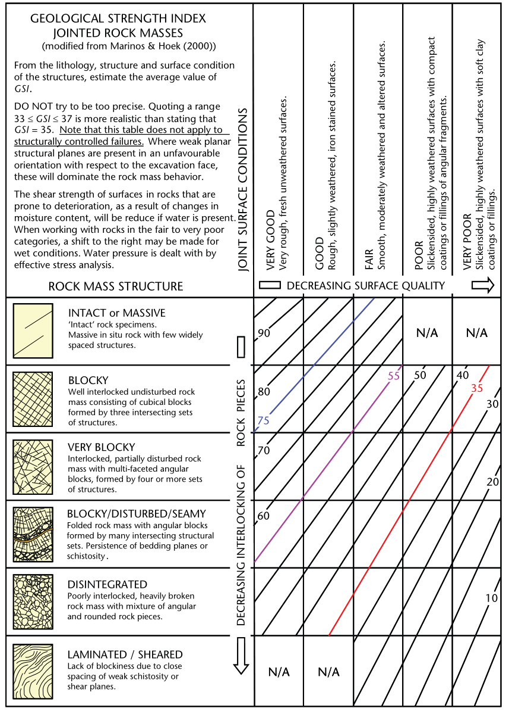
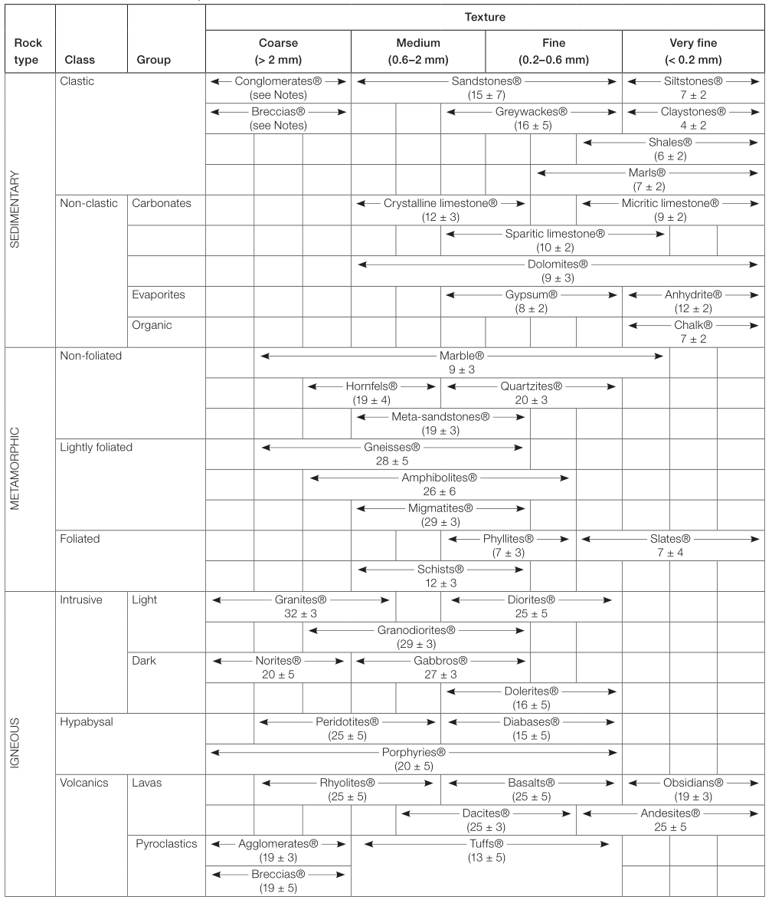
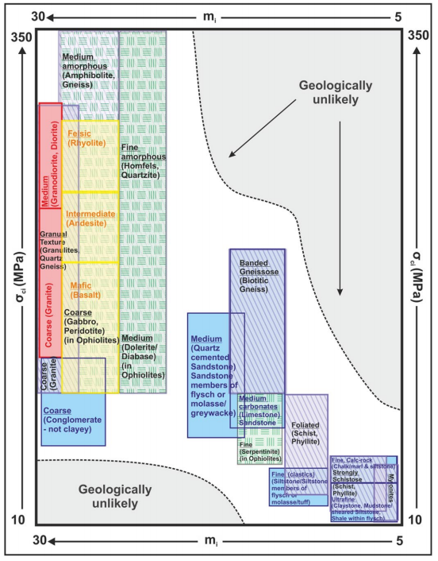

What it does: Performs Hoek-Brown analyses for rock and recommends additional parameters based on the inputs.

# Theory

## Introduction

The Hoek-Brown material model is the most widely used rock mechanic model due to its simplicity and ease-of-use in continuum based numerical models such as finite element or finite difference models.  Hoek-Brown model is published in Hoek & Brown (1980) and after that, it is constantly updated. Latest update was published in 2019.

## Input Parameters

There are 4 main input parameters for Hoek-Brown material model. Additional inputs are required to estimate rock mass modulus or equivalent Mohr-Coulomb parameters.

### Uniaxial Compressive Strength:

Uniaxial compressive strength is the compressive strength of intact rock. In field, the intact samples are selected to be tested in UCS test. If required samples are not found, point load tests can also be performed and the results of these tests can be converted to UCS using various correlations. 

### Geological Strength Index (GSI)

GSI is a number between 0-100 that defines the weathering or joint degree of a rock mass. This value is usually determined on the field based on the tunnel or slope faces, boreholes or outcrops. It is possible to correlate GSI to RMR (Rock Mass Rating) value using variety of correlations available in the literature. The most commonly used correlation is GSI=RMR-5. However, it should be noted that RMR' should be recalculated by neglecting the effect of groundwater and tunnel orientation.

GSI can also be estimated using the graph below. It is usually advised to keep the GSI above 25 for rock mass conditions.

### Material Constant for Intact Rock

Material constant (mi) is a fitting parameter which can be determined using the curve fitting technique on high quality triaxial tests or can be estimated using the ranges given in the table or figure below.

*Carter & Marinos (2020)*

### Disturbance Factor

Disturbance Factor is used to reflect the disturbance due to blast damage or stress relaxation. It is very unlikely to reach very high disturbance factors or very thick disturbed zones with the current technology. Hoek and Brown (2019) emphases that disturbance factor should not be applied to the whole rock mass. It should only be applied to a limited thickness. Literature shows that the usual thicknesses for disturbed zones are around 0.5-1.0 m. However, it is very usual to apply 3 m disturbed zone in drill and blast tunnelling.

> A common error is to assume that the disturbance factor D should be applied to the entire rock mass in which the excavation is conducted. This will result in an extremely conservative and inappropriate design.

### Modulus Ratio (MR)

Modulus ratio is the ratio of elastic modulus of intact rock to compressive strength of intact rock. In case of absence of any laboratory data, following ranges can be used.

*Carter and Marinos (2020)*

## General Equations

General equation for maximum and minimum effective principal stress at failure is calculated using the following equation:

$$\sigma_1'=\sigma_3'+\sigma_{ci}(m_b \frac{\sigma_3'}{\sigma_{ci}}+s)^\alpha$$

Equations for Hoek-Brown parameters are summarized below:

$$m_b = m_i \cdot exp \left(\frac{GSI-100}{28-14D}\right) $$

$$s=exp(\frac{GSI-100}{9-3D}) $$

$$\alpha =\frac{1}{2}+\frac{1}{6}(e^{-GSI/15-e^{-20/3}})$$

Uniaxial compressive strength of rock mass is calculated using the general equation by setting lateral pressure equal to zero.

$$\sigma_c = \sigma_{ci} \cdot s^a$$

Tensile strength of rock mass is:

$$\sigma_t = -\frac{s \sigma_{ci}}{m_b}$$

## Elasticity Modulus Calculations

There are tens of methods to calculate the rock mass modulus using GSI, RMR or other rock strength parameters. A good review of available methods is presented by Zhang (2017). Few of them are widely used and summarized here:

### Generalized Hoek and Diederichs (2016) Method

$$E_{rm} = E_i \cdot \left( 0.02+\frac{1-D/2} {1+e^{((60+15D-GSI)/11)}} \right)$$

### Simplified Hoek and Diederichs (2016) Method

$$E_{rm} = 100000\cdot \left( 0.02+\frac{1-D/2} {1+e^{((75+25D-GSI)/11)}} \right)$$

### Hoek, Carranza-Torres & Corkum (2002) Method

For UCS < 100 MPa:

$$E_{rm} = 1000  \cdot (1-D/2) \sqrt{\sigma_{ci}/100} \cdot 10^{(GSI-10)/40}$$

For UCS > 100 MPa:

E_{rm} = 1000  \cdot (1-D/2)  \cdot 10^{(GSI-10)/40}

### Yang (2006) Method

$$E_{rm} = \frac{E_i}{100} \cdot e^{GSI/21.7}$$

## Equivalent Mohr-Coulomb Parameters

Equivalent Mohr-Coulomb (MC) parameters can be estimated using the equations below. MC fit for HB parameters is just an approximation for the nonlinear HB curve on the given minor stress. Therefore, the MC parameters should be estimated using the expected pressures. In any case, Hoek and Brown recommends using HB parameters when possible.

Maximum lateral pressure, sigma_3 can be estimated using the approximate equations given by Hoek. Note that sigma_cm is rock mass strength and can be calcualated using the equation below:

### Lateral Pressure for Tunnels

### Lateral Pressure for Slopes

H is the height of the slope.

### General

For general cases, it is recommended to keep the lateral pressure around 25% of the UCS.

## Additional Parameters

Additional parameters are not part of the usual Hoek-Brown calculations. These parameters are listed as a supplementary aid to design.

### **Shear Wave Velocity Calculation by Brocher 2005**

To calculate the shear wave velocity in rock *Q* (Barton) - *Vp* an *Vs* relationship will be utilized. To calculate the *Q* value, FHWA-NHI-10-034 recommends following equation:

$$Q = 10^{\frac{RMR - 50}{15}}$$

RMR will be calculated assuming GSI = RMR - 5.

Barton (2002), described the relationship between *Q* and *Vp* (km/sec) as:

$$V_{p} = 3.5 + \log Q_{c}Vp=3.5+logQc$$

The Qc in this equation is the *Q* normalized with uniaxial compressive strength which can be calculated as  

$$Q_{c} = Q \cdot \left( \frac{\text{UCS}}{100} \right)$$

with *UCS* in *MPa*. Lastly, the relationship between *Vp* and *Vs* is adapted from a USGS research project, Brocher (2005):

$$V_{s} = 0.7858 - 1.2344 \cdot V_{p} + 0.7949 \cdot V_{p}^{2} - 0.1238 \cdot V_{p}^{3} + 0.0064 \cdot V_{p}^{4}Vs=0.7858−1.2344⋅Vp+0.7949⋅Vp2−0.1238⋅Vp3+0.0064⋅Vp4$$

Vs and Vp in this equation is in km/sec.

### Poisson's Ratio by Brocher 2005

$$v = 0.8835-0.315V_p + 0.0491V_p^2-0.00024V_p^3$$

### Shear Wave Velocity by Cha 2006

# References

1. Brown, E. T., & Hoek, E. (1980). Underground excavations in rock. CRC Press.
2. [Hoek, E., & Brown, E. T. (2019). The Hoek–Brown failure criterion and GSI–2018 edition. Journal of Rock Mechanics and Geotechnical Engineering, 11(3), 445-463.](https://doi.org/10.1016/j.jrmge.2018.08.001)
3. Carter, T. G., & Marinos, V. (2020). Putting geological focus back into rock engineering design. Rock Mechanics and Rock Engineering, 53(10), 4487-4508.
4. Hoek, E., & Diederichs, M. S. (2006). Empirical estimation of rock mass modulus. International journal of rock mechanics and mining sciences, 43(2), 203-215.
5. Zhang, L. (2017). Evaluation of rock mass deformability using empirical methods–A review. Underground Space, 2(1), 1-15.
6. Hoek, E., & Diederichs, M. S. (2006). Empirical estimation of rock mass modulus. International journal of rock mechanics and mining sciences, 43(2), 203-215.
7. Hoek, E., Carranza-Torres, C., & Corkum, B. (2002). Hoek-Brown failure criterion-2002 edition. Proceedings of NARMS-Tac, 1, 267-273.
8. Yang, K. (2006). “Analysis of laterally loaded drilled shafts in rock.” PhD Thesis, Univ. of Akron, Akron, OH
9. Brocher, T. M. (2005). Empirical relations between elastic wavespeeds and density in the Earth's crust. Bulletin of the seismological Society of America, 95(6), 2081-2092.
10. Cha, Y. H., Kang, J. S., & Jo, C. H. (2006). Application of linear-array microtremor surveys for rock mass classification in urban tunnel design. Exploration Geophysics, 37(1), 108-113.